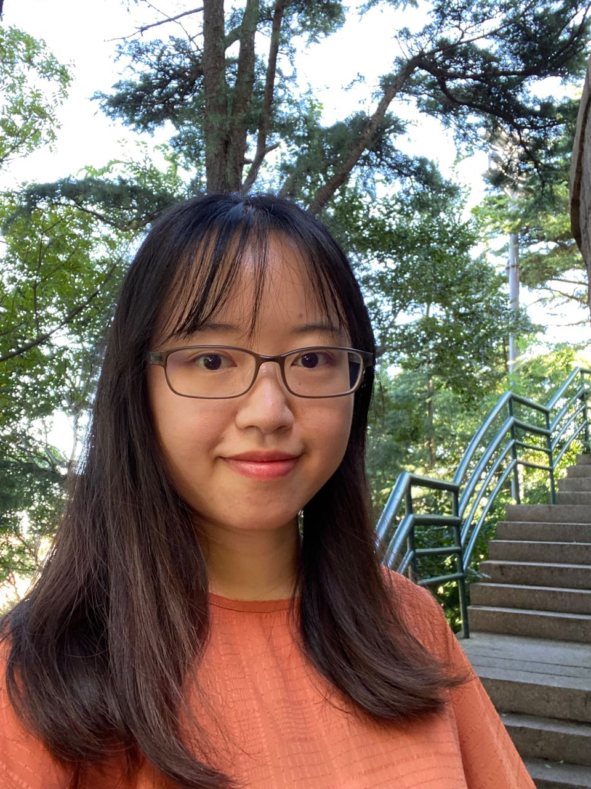
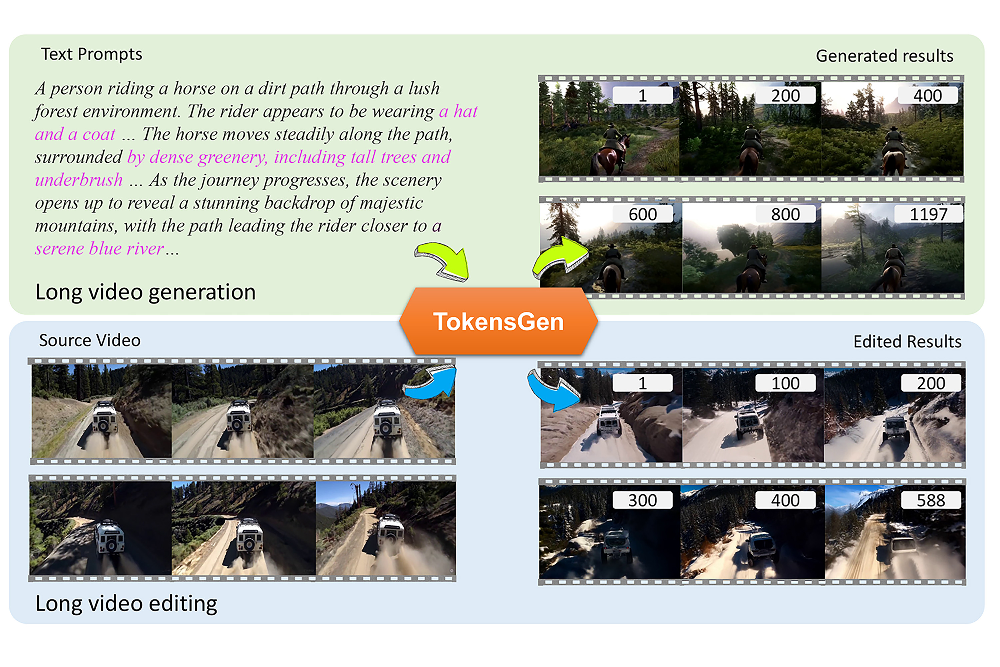
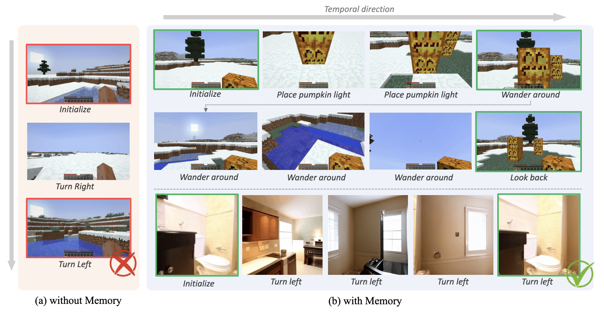
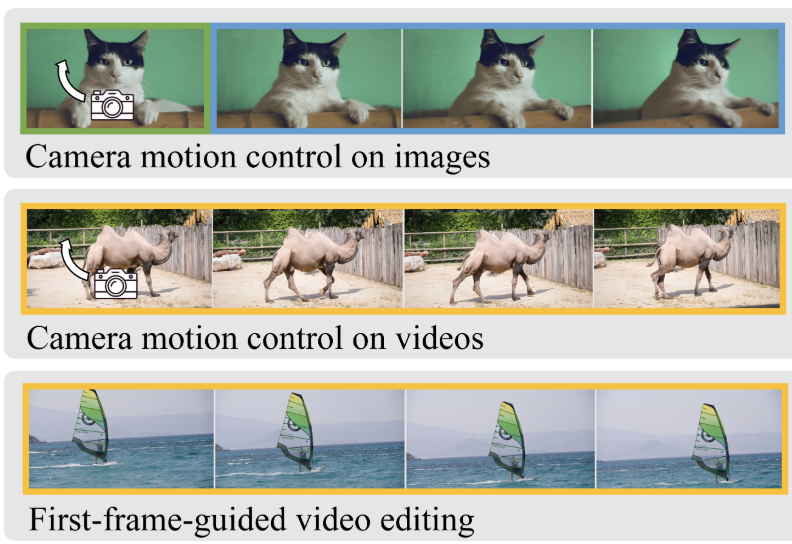
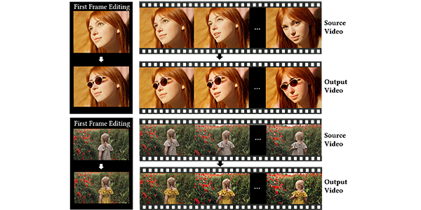
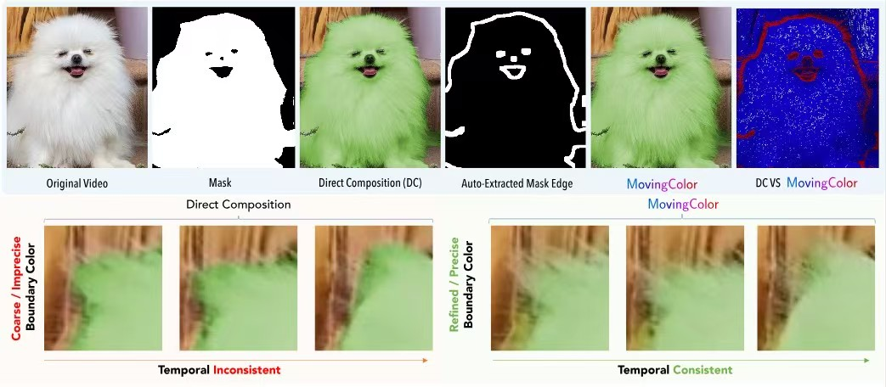
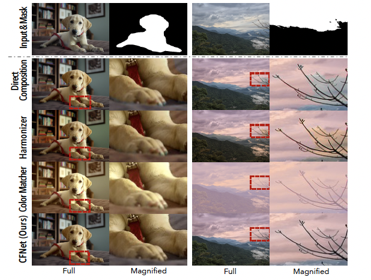
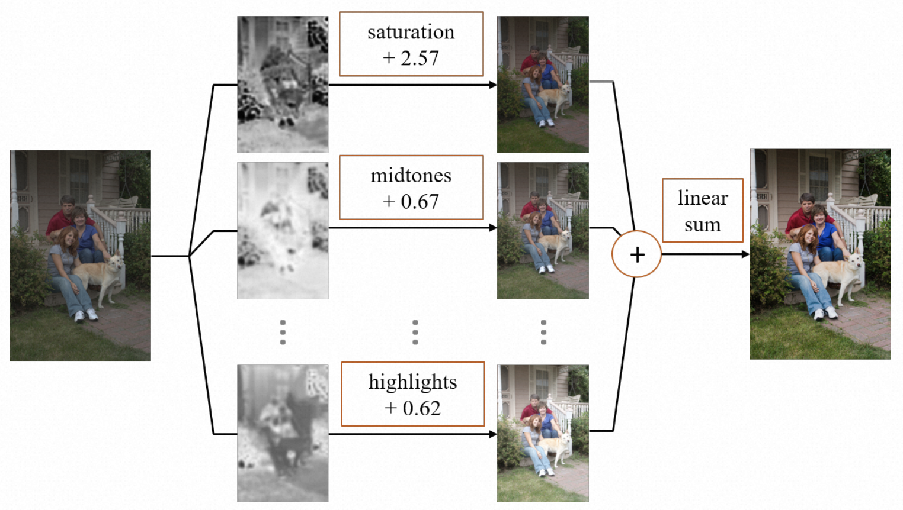
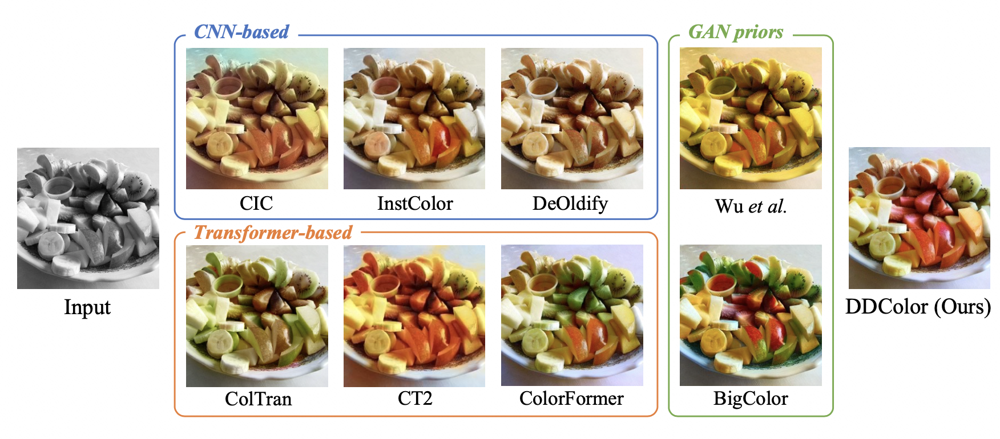

**Email:** vinkeyoy@gmail.com

**Links:** [[Google Scholar](https://scholar.google.com/citations?user=pYeM5JUAAAAJ&hl=zh-CN)] [[GitHub](https://github.com/Vicky0522)]

## About me
I am a Ph.D. student at [MMLab@NTU](https://www.mmlab-ntu.com/index.html), advised by Prof. [Xingang Pan](https://xingangpan.github.io/). I previously served as a senior research engineer at Damo Academy, Alibaba Group, where I focus on researching video enhancement and editing, working with [Peiran Ren](https://scholar.google.com/citations?user=x5dEuxsAAAAJ&hl=en), [Xuansong Xie](https://scholar.google.com/citations?user=M0Ei1zkAAAAJ&hl=en) and Prof. [Lei Zhang](https://www4.comp.polyu.edu.hk/~cslzhang/). Prior to joining Alibaba, I earned my M.Sc. degree in computer science and technology from Tsinghua University. I also hold a B.Sc. in fundamental physics and mathematics from Tsinghua University.

My research interests span several areas, including deep learning, computer vision, and image and video generation and editing. I am also interested in exploring the applications of natural language processing in multimedia analysis.

 

## Education
* B. Sc. in Fundamental Physics and Mathematics, Tsinghua University, Beijing. September 2012 ~ July 2016.
* B. BM. (Minor) in Business Administration in Economics and Management. September 2013 ~ July 2016.
* M. Sc. in Computer Science and Technology, Tsinghua University, Beijing. September 2016 ~ July 2019.
* Ph.D. student at MMLab@NTU, Singapore. January 2025 ~ Present.

## Working Experience
* Research Intern in ByteDance AI Lab, Beijing. July 2017 ~ Septempber 2017.
* Research Engineer in Damo Academy, Alibaba Group, Beijing. July 2019 ~ November 2023.
* Research Associate at MMLab@NTU, Singapore. November 2023 ~ Present.

## Publications
<ul class="publication-list">
  <li>
    

      
    

    

      <b>TokensGen: Harnessing Condensed Tokens for Long Video Generation</b> 
      <b>Wenqi Ouyang</b>, <a href="https://xizaoqu.github.io/" target="_blank" rel="opener">Zeqi Xiao</a>, <a href="https://scholar.google.com/citations?user=qDsgBJAAAAAJ&hl=zh-CN" target="_blank" rel="opener">Danni Yang</a>, <a href="https://zhouyifan.net/about/" target="_blank" rel="opener">Yifan Zhou</a>, <a href="https://williamyang1991.github.io/" target="_blank" rel="opener">Shuai Yang</a>, <a href="https://scholar.google.com.hk/citations?user=jZH2IPYAAAAJ&hl=en" target="_blank" rel="opener">Lei Yang</a>, <a href="https://jianlou.github.io/" target="_blank" rel="opener">Jianlou Si</a>, <a href="https://xingangpan.github.io/" target="_blank" rel="opener">Xingang Pan</a>.  
      <b><em>International Conference on Computer Vision (ICCV, 2025)</em></b> 
      <a href="https://arxiv.org/abs/2507.15728" target="_blank" rel="opener">
				 <i class="fa fa-file" aria-hidden="true"></i> arXiv </a> |
      <a href="https://vicky0522.github.io/tokensgen-webpage/" target="_blank" rel="noopener">
				 <i class="fa fa-file" aria-hidden="true"></i> Homepage </a> |
      <a href="https://github.com/Vicky0522/TokensGen" target="_blank" rel="noopener">
				 <i class="fa fa-file" aria-hidden="true"></i>  Code </a>
    

  </li>
  <li>
    

      
    

    

      <b>Worldmem: Long-term consistent world simulation with memory</b> 
      <a href="https://xizaoqu.github.io/" target="_blank" rel="opener">Zeqi Xiao</a>, <a href="https://nirvanalan.github.io/" target="_blank" rel="opener">Yushi Lan</a>, <a href="https://zhouyifan.net/about/" target="_blank" rel="opener">Yifan Zhou</a>, <b>Wenqi Ouyang</b>, <a href="https://williamyang1991.github.io/" target="_blank" rel="opener">Shuai Yang</a>, <a href="https://zengyh1900.github.io/" target="_blank" rel="opener">Yanhong Zeng</a>, <a href="https://xingangpan.github.io/" target="_blank" rel="opener">Xingang Pan</a>.  
      <b><em>arXiv preprint, 2025</em></b> 
      <a href="https://arxiv.org/abs/2504.12369" target="_blank" rel="opener">
				 <i class="fa fa-file" aria-hidden="true"></i> arXiv </a> |
      <a href="https://xizaoqu.github.io/worldmem/" target="_blank" rel="noopener">
				 <i class="fa fa-file" aria-hidden="true"></i> Homepage </a> |
      <a href="https://github.com/xizaoqu/WorldMem" target="_blank" rel="noopener">
				 <i class="fa fa-file" aria-hidden="true"></i>  Code </a>
    

  </li>
  <li>
    

      
    

    

      <b>Trajectory attention for fine-grained video motion control</b> 
      <a href="https://xizaoqu.github.io/" target="_blank" rel="opener">Zeqi Xiao</a>, <b>Wenqi Ouyang</b>, <a href="https://zhouyifan.net/about/" target="_blank" rel="opener">Yifan Zhou</a>, <a href="https://williamyang1991.github.io/" target="_blank" rel="opener">Shuai Yang</a>, <a href="https://scholar.google.com.hk/citations?user=jZH2IPYAAAAJ&hl=en" target="_blank" rel="opener">Lei Yang</a>, <a href="https://jianlou.github.io/" target="_blank" rel="opener">Jianlou Si</a>, <a href="https://xingangpan.github.io/" target="_blank" rel="opener">Xingang Pan</a>.  
      <b><em>International Conference on Learning Representations (ICLR, 2025)</em></b> 
      <a href="https://arxiv.org/abs/2411.19324" target="_blank" rel="opener">
				 <i class="fa fa-file" aria-hidden="true"></i> arXiv </a> |
      <a href="https://xizaoqu.github.io/trajattn/" target="_blank" rel="noopener">
				 <i class="fa fa-file" aria-hidden="true"></i> Homepage </a> |
      <a href="https://github.com/xizaoqu/TrajectoryAttention" target="_blank" rel="noopener">
				 <i class="fa fa-file" aria-hidden="true"></i>  Code </a>
    

  </li>
  <li>
    

      
    

    

      <b>I2VEdit: First-Frame-Guided Video Editing via Image-to-Video Diffusion Models</b> 
      <b>Wenqi Ouyang</b>, Yi Dong, <a href="https://scholar.google.com.hk/citations?user=jZH2IPYAAAAJ&hl=en" target="_blank" rel="opener">Lei Yang</a>, <a href="https://jianlou.github.io/" target="_blank" rel="opener">Jianlou Si</a>, <a href="https://xingangpan.github.io/" target="_blank" rel="opener">Xingang Pan</a>.  
      <b><em>SIGGRAPH Asia (Conference Track), 2024</em></b> 
      <a href="https://arxiv.org/abs/2405.16537" target="_blank" rel="opener">
				 <i class="fa fa-file" aria-hidden="true"></i> arXiv </a> |
      <a href="https://i2vedit.github.io/" target="_blank" rel="noopener">
				 <i class="fa fa-file" aria-hidden="true"></i> Homepage </a> |
      <a href="https://github.com/Vicky0522/I2VEdit" target="_blank" rel="noopener">
				 <i class="fa fa-file" aria-hidden="true"></i>  Code </a>
    

  </li>
  <li>
  

      
    

    

      <b>MovingColor: Seamless Fusion of Fine-grained Video Color Enhancement</b> 
      Yi Dong, <a href="https://github.com/NTUYWANG103" target="_blank" rel="opener">Yuxi Wang</a>, Zheng Fang, <b>Wenqi Ouyang</b>, <a href="https://scholar.google.com/citations?user=wLTXeNwAAAAJ&hl=fr" target="_blank" rel="opener">Xianhui Lin</a>, <a href="https://scholar.google.com/citations?user=EA2T_lwAAAAJ&hl=en" target="_blank" rel="opener">Zhiqi Shen</a>, <a href="https://scholar.google.com/citations?user=x5dEuxsAAAAJ&hl=en" target="_blank" rel="opener">Peiran Ren</a>, <a href="https://scholar.google.com/citations?user=M0Ei1zkAAAAJ&hl=en" target="_blank" rel="opener">Xuansong Xie</a>, <a href="https://scholar.google.com/citations?user=J1vMnRgAAAAJ&hl=en" target="_blank" rel="opener">Qingming Huang</a>.  
      <b><em>ACM International Conference on Multimedia (ACM MM, 2024)</em></b> 
      <a href="https://dl.acm.org/doi/abs/10.1145/3664647.3681130" target="_blank" rel="opener">
				 <i class="fa fa-file" aria-hidden="true"></i> Paper </a> |
      <a href="https://yidong.pro/projects/movingcolor" target="_blank" rel="noopener">
				 <i class="fa fa-file" aria-hidden="true"></i> Homepage </a> |
      <a href="https://github.com/NTUYWANG103/MovingColor" target="_blank" rel="noopener">
				 <i class="fa fa-file" aria-hidden="true"></i>  Code </a>
    

  </li>
  <li>
  

      
    

    

      <b>ChromaFusionNet (CFNet): natural fusion of fine-grained color editing</b> 
      Yi Dong, <a href="https://github.com/NTUYWANG103" target="_blank" rel="opener">Yuxi Wang</a>, Ruoxi Fan, <b>Wenqi Ouyang</b>, <a href="https://scholar.google.com/citations?user=EA2T_lwAAAAJ&hl=en" target="_blank" rel="opener">Zhiqi Shen</a>, <a href="https://scholar.google.com/citations?user=x5dEuxsAAAAJ&hl=en" target="_blank" rel="opener">Peiran Ren</a>, <a href="https://scholar.google.com/citations?user=M0Ei1zkAAAAJ&hl=en" target="_blank" rel="opener">Xuansong Xie</a>.  
      <b><em>AAAI Conference on Artificial Intelligence (AAAI, 2024)</em></b> 
      <a href="https://ojs.aaai.org/index.php/AAAI/article/view/27925" target="_blank" rel="opener">
				 <i class="fa fa-file" aria-hidden="true"></i> Paper </a> |
      <a href="https://yidong.pro/projects/cfnet" target="_blank" rel="noopener">
				 <i class="fa fa-file" aria-hidden="true"></i> Homepage </a> |
      <a href="https://github.com/NTUYWANG103/CFNet" target="_blank" rel="noopener">
				 <i class="fa fa-file" aria-hidden="true"></i>  Code </a>
    

  </li>
  <li>
    

      
    

    

      <b>RSFNet: A White-Box Image Retouching Approach using Region-Specific Color Filters</b> 
      <b>Wenqi Ouyang</b>, Yi Dong, <a href="https://piddnad.github.io/xiaoyangkang" target="_blank" rel="opener">Xiaoyang Kang</a>, <a href="https://scholar.google.com/citations?user=x5dEuxsAAAAJ&hl=en" target="_blank" rel="opener">Peiran Ren</a>, Xin Xu, <a href="https://scholar.google.com/citations?user=M0Ei1zkAAAAJ&hl=en" target="_blank" rel="opener">Xuansong Xie</a>.  
      <b><em>International Conference on Computer Vision (ICCV, 2023)</em></b> 
      <a href="https://arxiv.org/abs/2303.08682" target="_blank" rel="noopener">
				 <i class="fa fa-file" aria-hidden="true"></i> arXiv </a> |
      <a href="https://github.com/Vicky0522/RSFNet" target="_blank" rel="noopener">
				 <i class="fa fa-file" aria-hidden="true"></i>  Code </a> 
    

  </li>
  <li>
    

      
    

    

      <b>DDColor: Towards Photo-Realistic and Semantic-Aware Image Colorization via Dual Decoders</b> 
      <a href="https://piddnad.github.io/xiaoyangkang" target="_blank" rel="opener">Xiaoyang Kang</a>, <a href="https://cg.cs.tsinghua.edu.cn/people/~tyang/" target="_blank" rel="opener">Tao Yang</a>, <b>Wenqi Ouyang</b>, <a href="https://scholar.google.com/citations?user=x5dEuxsAAAAJ&hl=en" target="_blank" rel="opener">Peiran Ren</a>, <a href="https://lingzhili.com/" target="_blank" rel="opener">Lingzhi Li</a>, <a href="https://scholar.google.com/citations?user=M0Ei1zkAAAAJ&hl=en" target="_blank" rel="opener">Xuansong Xie</a>.  
      <b><em>International Conference on Computer Vision (ICCV, 2023)</em></b> 
      <a href="https://arxiv.org/abs/2212.11613" target="_blank" rel="noopener">
				 <i class="fa fa-file" aria-hidden="true"></i> arXiv </a> |
      <a href="https://github.com/piddnad/DDColor" target="_blank" rel="noopener">
				 <i class="fa fa-file" aria-hidden="true"></i>  Code </a> 
    

  </li>
</ul>

## Patents
<ul class="publication-list">
  <li>
    

      <b>Methods, systems, and electronic devices for image processing</b> 
      Yi Dong, Yuxi Wang, Ruoxi Fan, <b>Wenqi Ouyang</b>, <a href="https://scholar.google.com.sg/citations?user=EA2T_lwAAAAJ&hl=en" target="_blank" rel="opener">Zhiqi Shen</a>, <a href="https://scholar.google.com/citations?user=x5dEuxsAAAAJ&hl=en" target="_blank" rel="opener">Peiran Ren</a>, <a href="https://scholar.google.com/citations?user=M0Ei1zkAAAAJ&hl=en" target="_blank" rel="opener">Xuansong Xie</a>.  
      CN Patent 117,788,352 A, 2023.  
    

  </li>
  <li>
    

      <b>Methods, systems, devices, and storage media for color grading of images and videos</b> 
      <b>Wenqi Ouyang</b>, <a href="https://cg.cs.tsinghua.edu.cn/people/~tyang/" target="_blank" rel="opener">Tao Yang</a>.  
      CN Patent 114,549,674 A, 2022.  
    

  </li>
  <li>
    

      <b>Methods and apparatus for video processing</b> 
      <a href="https://scholar.google.com/citations?user=wLTXeNwAAAAJ&hl=fr" target="_blank" rel="opener">Xianhui Lin</a>, <a href="https://scholar.google.com/citations?user=CF2CM2UAAAAJ&hl=zh-CN" target="_blank" rel="opener">Zhanning Gao</a>, <b>Wenqi Ouyang</b>, <a href="https://scholar.google.com/citations?user=x5dEuxsAAAAJ&hl=en" target="_blank" rel="opener">Peiran Ren</a>.  
      CN Patent 114,302,175 A, 2022.  
    

  </li>
  <li>
    

      <b>Methods and apparatus for video processing</b> 
      <a href="https://scholar.google.com/citations?user=wLTXeNwAAAAJ&hl=fr" target="_blank" rel="opener">Xianhui Lin</a>, <a href="https://scholar.google.com/citations?user=CF2CM2UAAAAJ&hl=zh-CN" target="_blank" rel="opener">Zhanning Gao</a>, <b>Wenqi Ouyang</b>, <a href="https://cg.cs.tsinghua.edu.cn/people/~tyang/" target="_blank" rel="opener">Tao Yang</a>, <a href="https://scholar.google.com/citations?user=x5dEuxsAAAAJ&hl=en" target="_blank" rel="opener">Peiran Ren</a>, Feiying Ma, <a href="https://scholar.google.com/citations?user=M0Ei1zkAAAAJ&hl=en" target="_blank" rel="opener">Xuansong Xie</a>, <a href="https://www4.comp.polyu.edu.hk/~cslzhang/" target="_blank" rel="opener">Lei Zhang</a>.  
      CN Patent 114,286,126 A, 2022.  
    

  </li>
  <li>
    

      <b>Methods and apparatus for training image processing model</b> 
      <a href="https://quanlzheng.github.io/" target="_blank" rel="opener">Quanlong Zheng</a>, <a href="https://huizeng.github.io/" target="_blank" rel="opener">Hui Zeng</a>, <b>Wenqi Ouyang</b>.  
      CN Patent 114,092,756 A, 2022.   
    

  </li>
  <li>
    

      <b>A method for video color grading, media data processing, device, and storage medium</b> 
      <b>Wenqi Ouyang</b>.  
      CN Patent 113,497,954 A, 2021.  
    

  </li>
</ul>
